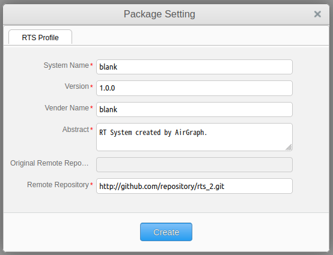
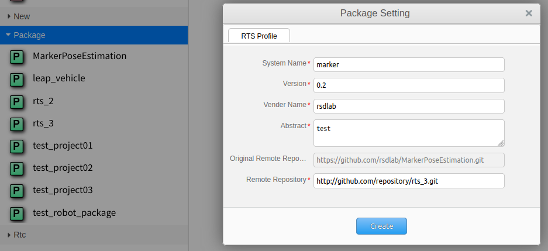
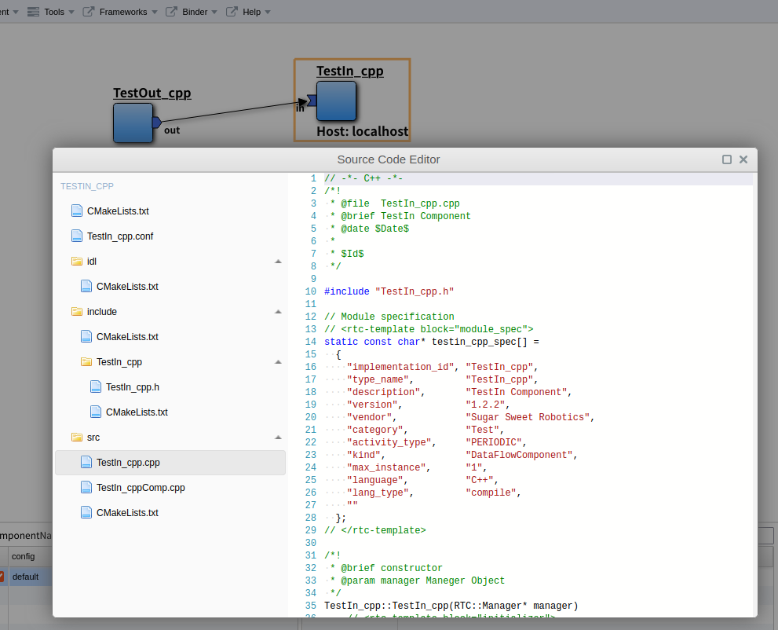
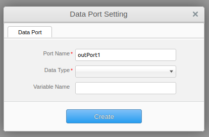

.. AirGraph documentation master file, created by
   sphinx-quickstart on Wed Aug  1 22:17:25 2018.
   You can adapt this file completely to your liking, but it should at least
   contain the root `toctree` directive.

AirGraph (RTM Editor)
=======================

概要
---------
AirGraph (RTM Editor)の主な機能は次の通りです．

- WEBブラウザ上でRTMによるロボットシステム開発が可能
- ロボットシステム単位での一覧・再利用が可能
- コンポーネント単位での一覧・再利用が可能

.. image:: ../img/rtm_ide.png
  :width: 70%
  :align: center

- 画面構成

 - 画面上部：操作メニューエリア
 - 画面左部：システム・コンポーネントの一覧表示エリア
 - 画面右部：システム・コンポーネントのプロパティ設定エリア
 - 画面下部：システムのコンフィギュレーション設定エリア
 - 画面中央：システム構築・コンポーネント開発エリア

OpenRTM-aistとの関係について
---------------------------------
- `OpenRTM-aist <http://openrtm.org/>`_ では以下の2つの主なツールが提供されています．

 - RTCBuilder
 - RTSystemEditor

- 基本的にはAirGraphと上記ツールには互換性があります．

 - RTCBuilderにて作成したコンポーネントはAirGraphで表示・編集することが可能です．
 - AirGraphで作成したコンポーネントをRTCBuilderで表示する場合，以下の修正が必要です．

  - RTC.xmlのNNInfoタグを削除する

 - AirGraphで実行中のシステムは，RTSystemEditorで表示することが可能です．

wasanbonとの関係について
---------------------------------
- AirGraphはパッケージ・コンポーネントの構成管理ツールとして `wasanbon <http://wasanbon.org/>`_ を利用しています．
- wasanbonを直接操作することで，コンソール上での構築も可能です．

使い方
-----------
パッケージを新規に作成する
'''''''''''''''''''''''''''

1. 画面左部の[New]-[New Pkg.]を画面中央にドラッグ＆ドロップします．
2. パッケージの設定画面が表示されますので，内容を変更し，[Create]ボタンを押下します．

================= ========================
項目名             概要
================= ========================
Package Name      パッケージ名
Version           バージョン番号
Vender Name       会社名
Abstract          パッケージ概要
Remote Repository GitHubなどのリポジトリURL
================= ========================

3. 画面左部の[Workspace]に新しいパッケージが表示され，画面中央には何もない状態になります．

パッケージを流用して作成する
'''''''''''''''''''''''''''''

1. 画面左部の[Package]の任意のパッケージを画面中央にドラッグ＆ドロップします．
2. 新規作成時と同様に，パッケージの設定画面が表示されますので，必要な箇所を変更し，[Create]ボタンを押下します．
3. 画面左部の[Workspace]にコピーされたパッケージが表示され，画面中央にはそのパッケージに含まれるコンポーネントが表示されます．

パッケージのプロパティを変更する
'''''''''''''''''''''''''''''''''''

.. image:: ../img/rtm_update_package.png
  :width: 70%
  :align: center

1. 以下のいずれかの方法でパッケージの設定画面を起動します．

 - コンポーネントが未選択の状態で，画面下部の[Property]ボタンを押下する（画面右部に表示されます）．
 - 画面上部の[Tools]-[Package Setting]を押下する．
 - 画面中央の白い領域で表示される右クリックメニューの[edit Package Setting]を押下する.

2. 必要な箇所を変更し，[Update]ボタンを押下します．

コンポーネントを新規に作成する
'''''''''''''''''''''''''''''''

.. image:: ../img/rtm_create_component.png
  :width: 70%
  :align: center

1. 画面左部の[New]-[New Comp(C++).]または[New Comp(Python).]を画面中央にドラッグ＆ドロップします．
2. コンポーネントの設定画面が表示されますので，内容を変更し，[Create]ボタンを押下します．

================== ========================
項目名              概要
================== ========================
Module Name        コンポーネント名
Module Description コンポーネント概要
Version            バージョン番号
Vender Name        会社名
Module Category    コンポーネントカテゴリ
Component Type     コンポーネント型
Activity Type      アクティビティ型
Component Kind     コンポーネント種類
Max Instance Size  最大インスタンス数
Execution Type     実行型
Execution Rate     実行周期
Abstract           コンポーネント概要
RTC Type           RTC型
DNN Model Name     DNNモデル名
Dataset Name       データセット名
================== ========================

3. 画面中央にコンポーネント名と青いコンポーネントが表示されます．

コンポーネントを流用して作成する
'''''''''''''''''''''''''''''''''

.. image:: ../img/rtm_copy_component.png
  :width: 70%
  :align: center

1. 画面左部の[Rtc]の任意のコンポーネントを画面中央にドラッグ＆ドロップします．
2. 画面中央にコンポーネント名と青いコンポーネントが表示されます．

コンポーネントのプロパティを変更する
'''''''''''''''''''''''''''''''''''''''

.. image:: ../img/rtm_update_component.png
  :width: 70%
  :align: center

1. 以下のいずれかの方法でパッケージの設定画面を起動します．

 - コンポーネントを選択している状態で，画面下部の[Property]ボタンを押下する（画面右部に表示されます）．
 - コンポーネントの右クリックメニューの[edit Component Setting]を押下する.

2. 必要な箇所を変更し，[Update]ボタンを押下します．

- [RTC Activities]タブのチェックボックスを変更すると，該当するメソッドの有効無効が自動反映されます.
- 主なメソッドは以下の通りです．

============= =======================================================================
メソッド名     概要
============= =======================================================================
OnInitialize  初期化される際に一度だけ呼ばれます．
OnActivated   非アクティブ状態からアクティブ化されるとき，一度だけ呼ばれます．
OnExecute     アクティブ状態時に周期的に呼ばれます．
OnDeactivated アクティブ状態から非アクティブ化されるとき，一度だけ呼ばれます．
OnAborting    エラー状態に入る前に一度だけ呼ばれます．
OnReset       エラー状態からリセットされ，非アクティブ状態に遷移する際に一度だけ呼ばれます．
OnError       エラー状態にいる間，周期的に呼ばれます．
OnFinalize    コンポーネントの終了時に一度だけ呼ばれます．
OnStateUpdate OnExecuteの後，毎回呼ばれます．
OnRateChanged 実行コンテキストのrateが変更された際に呼ばれます．
OnStartup     実行コンテキストが実行を開始する際に一度だけ呼ばれます．
OnShutdown    実行コンテキストが実行を停止する際に一度だけ呼ばれます．
============= =======================================================================

ソースコードを編集する
'''''''''''''''''''''''''''''

1. コンポーネントのダブルクリック，またはコンポーネントの右クリックメニューから[edit Source Code]を押下します．
2. ソースコード編集画面が表示されますので，任意の変更を行います．

 - Pythonの場合，コンポーネント名.pyがメインのソースコードです．
 - C++の場合，includeフォルダのコンポーネント名.hとsrcフォルダのコンポーネント名.cppがメインのソースコードです．

3. 変更が終わったら，ソースコード編集画面を終了します．

 - このタイミングではブラウザ上のみの変更で，サーバ上には変更は反映されていません．

データポートを追加・変更する
'''''''''''''''''''''''''''''

1. データポートを追加する場合，コンポーネントの右クリックメニューから[add Input Port]または[add Output Port]を押下します．

 - 変更する場合はポートの右クリックメニューの[edit Port]を押下します．

2. ポートの設定画面が表示されますので，内容を変更し，[Create]ボタンを押下します．

============= =========
項目名        概要
============= =========
Port Name     ポート名
Data Type     データ型
Variable Name 変数名
============= =========

3. 変更がサーバに自動反映され，必要なポート定義がソースコードに自動反映されます．

- C++の場合

.. code-block:: csharp

  // <rtc-template block="inport_declare">
  RTC::TimedLong m_port;
  InPort<RTC::TimedLong> m_portIn;
  // </rtc-template>

.. code-block:: csharp

  cpp_test::cpp_test(RTC::Manager* manager)
      // <rtc-template block="initializer">
    : RTC::DataFlowComponentBase(manager),
      m_portIn("port", m_port)
      // </rtc-template>
  {
  }
  
  RTC::ReturnCode_t cpp_test::onInitialize()
  {
    // Set InPort Buffers
    addInPort("port", m_portIn);
  }

- Pythonの場合

.. code-block:: python

	def __init__(self, manager):
		OpenRTM_aist.DataFlowComponentBase.__init__(self, manager)
		
		self._d_port = RTC.TimedLong(RTC.Time(0,0), 0)
		self._portOut = OpenRTM_aist.OutPort("port", self._d_port)

	def onInitialize(self):
		# Bind variables and configuration variable
		
		# Set InPort buffers
		
		# Set OutPort buffers
		self.addOutPort("port", self._portOut)

サービスポートを追加・変更する
'''''''''''''''''''''''''''''''

.. image:: ../img/rtm_serviceport.png
  :width: 70%
  :align: center

1. サービスポートを追加する場合，コンポーネントの右クリックメニューから[add Service Port]を押下します．

 - 変更する場合はポートの右クリックメニューの[edit Port]を押下します．

2. ポートの設定画面が表示されますので，内容を変更します．

============= =========
項目名        概要
============= =========
Port Name     ポート名
Position      表示位置
============= =========

3. サービスポートを利用するためには，インターフェースを定義する必要があるため，画面左下の[Add]ボタンを押下します．
4. インタフェースが一覧に追加されますので，追加したインタフェースを選択し，画面右側の内容を変更します．

============== ===============
項目名          概要
============== ===============
Interface Name インタフェース名
Direction      方向
Instance Name  インスタンス名
Variable Name  変数名
IDL File       IDLファイル
Interface Type インタフェース型
============== ===============

 - 独自型でのインターフェースを実現したい場合，画面下部の[Upload_IDL_File]ボタンを押下し，IDLファイルをアップロードすることが可能です．
 - アップロードしたIDLファイルは，各コンポーネントのIDLフォルダに配置されます（ソースコードとして編集も可能です）．

5. 変更が完了したら，[Create]ボタンを押下します．
6. 変更がサーバに自動反映され，必要なポート定義などがソースコードに自動反映されます．

- C++の場合

.. code-block:: csharp

  // CORBA Port declaration
  // <rtc-template block="corbaport_declare">
  RTC::CorbaPort m_servicePortPort;
  // </rtc-template>

  // Service declaration
  // <rtc-template block="service_declare">
  Img_CameraCaptureServiceSVC_impl m_interface;
  // </rtc-template>

.. code-block:: csharp

  cpp_test::cpp_test(RTC::Manager* manager)
      // <rtc-template block="initializer">
    : RTC::DataFlowComponentBase(manager),
      m_servicePortPort("servicePort")
      // </rtc-template>
  {
  }
  
  RTC::ReturnCode_t cpp_test::onInitialize()
  {
    // Set service provider to Ports
    m_servicePortPort.registerProvider("interface", "Img::CameraCaptureService", m_interface);
    // Set service consumers to Ports
    // Set CORBA Service Ports
    addPort(m_servicePortPort);
  }

- Pythonの場合

.. code-block:: python

	def __init__(self, manager):
		OpenRTM_aist.DataFlowComponentBase.__init__(self, manager)
		
		self._servicePortPort = OpenRTM_aist.CorbaPort("servicePort")
		self._interface = Img_CameraCaptureService_i()

	def onInitialize(self):
		# Set service providers to Ports
		self._servicePortPort.registerProvider("interface", "Img::CameraCaptureService", self._interface)
		# Set CORBA Service Ports
		self.addPort("self._servicePortPort")

コンフィギュレーションを追加・変更する
'''''''''''''''''''''''''''''''''''''''

.. image:: ../img/rtm_configuration.png
  :width: 70%
  :align: center

1. コンフィギュレーションを追加・変更する場合，コンポーネントの右クリックメニューから[edit Configuration Parameter]を押下します．
2. コンフィギュレーション設定画面が表示されますので，画面左下の[Add]ボタンを押下します．
3. コンフィギュレーションが一覧に追加されますので，追加されたコンフィギュレーションを選択し，画面右側の内容を変更します．

============= ===============
項目名          概要
============= ===============
Name          パラメタ名
Type          データ型
Default Value 初期値
Variable Name 変数名
Unit          単位
Constraint    制約条件
Widget        Textのみ
Step          選択不可
============= ===============

4. 変更が完了したら，[Update]ボタンを押下します．
5. 変更がサーバに自動反映され，必要な変数定義などがソースコードに自動反映されます．

- C++の場合

.. code-block:: csharp

  // <rtc-template block="config_declare">
  /*!
   *
   * - Name:  conf_name0
   * - DefaultValue: 0
   */
  int m_conf_name0;
  // </rtc-template>

.. code-block:: csharp

  RTC::ReturnCode_t cpp_test::onInitialize()
  {
    // Bind variables and configuration variable
    bindParameter("conf_name0", m_conf_name0, "0");
    
    return RTC::RTC_OK;
  }

- Pythonの場合

.. code-block:: python

	def __init__(self, manager):
		OpenRTM_aist.DataFlowComponentBase.__init__(self, manager)
		# <rtc-template block="init_conf_param">
		"""
		 - Name:  conf_name0
		 - DefaultValue: 0
		"""
		self._conf_name0 = [0]
		# </rtc-template>

	def onInitialize(self):
		# Bind variables and configuration variable
		self.bindParameter("conf_name0", self._conf_name0, "0")

パッケージを構築する
'''''''''''''''''''''

.. image:: ../img/rtm_connect.png
  :width: 70%
  :align: center

1. コンポーネントの出力ポートをクリックし，表示された矢印を別コンポーネントの入力ポートにドロップします．

パッケージ・コンポーネントを保存する
'''''''''''''''''''''''''''''''''''''
1. 以下のいずれかの方法でパッケージおよびコンポーネントの保存を行います．

 - 画面上部の[File]-[Save All]を押下する．
 - 画面中央の白い領域で表示される右クリックメニューの[save All]を押下する.

2. 全ての変更が保存され，コンポーネントの変更内容からパッケージの定義情報が更新されます．

パッケージ・コンポーネントをビルドする
''''''''''''''''''''''''''''''''''''''

.. image:: ../img/rtm_build.png
  :width: 70%
  :align: center

1. 画面上部の[Component]-[Build All]を押下します．
2. コンソール画面が表示されますので，左側の画面に"Success"と表示されれば成功です．

 - Pythonの場合，ビルドは不要ですが，実行周期の設定などを更新する必要があるので，システム実行前はビルドしてください．

3. C++で"Failed"と表示された場合は，ソースコードの再編集を行ってください．

 - コンソールは自動更新されますので，自動更新を止める場合は，画面下部の[Auto tail and Scroll to bottom]のチェックボックスをOFFにしてください．

システムを実行する
'''''''''''''''''''

.. image:: ../img/rtm_run.png
  :width: 70%
  :align: center

1. 画面上部の[Component]-[Run Package]を押下します．
2. コンソール画面が表示されますので，左側の画面に"Activate"と表示されれば成功です．

 - IDEではコンポーネントのプロセス起動からアクティブ化までを一気に行います．

3. Kill Processなどが表示された場合，何らかのエラーが発生していますので，ソースコードの再編集・再ビルドを行ったください．

 - Pythonの場合は構文エラーでも実行時に検出されるため，画面右側にエラーなどが表示されている可能性があります．
 - コンソールは自動更新されますので，自動更新を止める場合は，画面下部の[Auto tail and Scroll to bottom]のチェックボックスをOFFにしてください．

システムを停止する
'''''''''''''''''''

.. image:: ../img/rtm_stop.png
  :width: 70%
  :align: center

1. 画面上部の[Component]-[Terminate Package]を押下します．
2. コンソール画面が表示されますので，左側の画面に"Kill Process"などが表示されれば成功です．

コンポーネントをGitリポジトリと連携する
'''''''''''''''''''''''''''''''''''''''''
- Gitリポジトリと連携する場合，あらかじめgitconfgの設定が必要となります．
- はじめてCommitを行う場合には，IDEを実行しているサーバ上でコンソールからgitconfigの設定を行ってください．

.. code-block:: bash

  $ git config --global user.name "your name"
  $ git config --global user.email youremail@example.com

.. image:: ../img/rtm_component_git.png
  :width: 70%
  :align: center

1. コンポーネントの右クリックメニューから[Git Repository Link]を押下します．
2. Gitリポジトリ設定画面が表示されますので，ユーザ名などの項目を入力し，[Commit & Push]ボタンを押下します．
3. Result欄に結果が表示されます．

 - Git側のリモートリポジトリはIDE上から作成することはできないため，あらかじめGitHub上などで作成してください．
 - ローカルリポジトリのみに反映する場合には，[Commit]ボタンを押下してください．
 - ~/.netrcなどにユーザ名・パスワードをあらがじめ書いておくことで，ユーザ名・パスワードの入力を省略することが可能です．

パッケージをGitリポジトリと連携する
'''''''''''''''''''''''''''''''''''''''''

.. image:: ../img/rtm_package_git.png
  :width: 70%
  :align: center

1. 以下のいずれかの方法でGitリポジトリ設定画面を起動します．

 - 画面上部の[File]-[Git Repository Link]を押下する．
 - 画面中央の白い領域で表示される右クリックメニューの[Git Repository Link]を押下する.

2. Gitリポジトリ設定画面が表示されますので，ユーザ名などの項目を入力し，[Commit & Push]ボタンを押下します．
3. Result欄に結果が表示されます．

 - 自動的にパッケージにコンポーネントのリポジトリが紐付けられます．
 - Git側のリモートリポジトリはIDE上から作成することはできないため，あらかじめGitHub上などで作成してください．
 - ローカルリポジトリのみに反映する場合には，[Commit]ボタンを押下してください．
 - ~/.netrcなどにユーザ名・パスワードをあらがじめ書いておくことで，ユーザ名・パスワードの入力を省略することが可能です．

その他
-----------
コンポーネントの一覧について
'''''''''''''''''''''''''''''
1. 画面左側に表示されるコンポーネントの一覧はwasanbonのbinder機能を利用して集めており，AirGraphに最初にアクセスしたタイミングで全てのパッケージ・コンポーネントをCloneします．

 - その際，認証が必要なPrivateリポジトリなどは取得できません．
 - ~/.netrcにあらかじめ認証情報を付与しておくなどしてください．

2. 現時点で，AirGraph上から作成したパッケージやコンポーネントをwasanbonのbinderに登録する機能はありませんので，wasanbonの機能を利用してください．`参考 <http://wasanbon.org/?page_id=1727>`_
