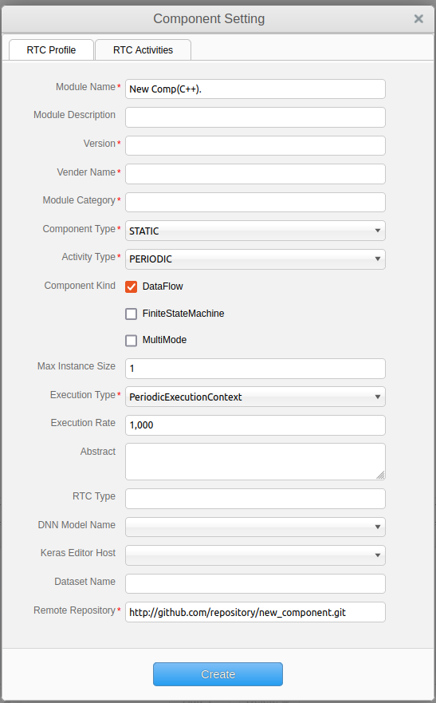
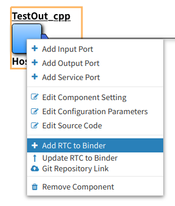

.. AirGraph documentation master file，created by
   sphinx-quickstart on Wed Aug  1 22:17:25 2018.
   You can adapt this file completely to your liking，but it should at least
   contain the root `toctree` directive.

AirGraph (RTM Editor)
=======================

概要
---------
AirGraph (RTM Editor)の主な機能は次の通りです．

- WEBブラウザ上でRTMによるロボットシステム開発が可能
- ロボットシステム単位での一覧・再利用が可能
- コンポーネント単位での一覧・再利用が可能

.. image:: ../img/rtm_ide.png
  :width: 100%
  :align: center

- 画面構成

 - 画面上部：操作メニューエリア
 - 画面左部：システム・コンポーネントの一覧表示エリア
 - 画面右部：システム・コンポーネントのプロパティ設定エリア / ホスト設定エリア
 - 画面下部：システムのコンフィギュレーション設定エリア
 - 画面中央：システム構築・コンポーネント開発エリア

OpenRTM-aistとの関係について
---------------------------------
`OpenRTM-aist <http://openrtm.org/>`_ では以下の2つの主なツールが提供されています．

- RTCBuilder
- RTSystemEditor

基本的にはAirGraphと上記ツールには互換性があります．

RTCBuilderにて作成したコンポーネントはAirGraphで表示・編集することが可能です．
ただし、AirGraphで作成したコンポーネントをRTCBuilderで表示する場合，以下の修正が必要です．

- RTC.xmlのNNInfoタグを削除する．

AirGraphで実行中のシステムは，RTSystemEditorで表示することが可能です．

wasanbonとの関係について
---------------------------------
AirGraphはパッケージ・コンポーネントの構成管理ツールとして `wasanbon-webframework <https://github.com/wasanbon/wasanbon_webframework>`_ を利用しています．

`wasanbon <http://wasanbon.org/>`_ を直接操作することで，Terminal上での構築も可能です．

使い方
-----------

ホストを設定する
'''''''''''''''''''''''''''
1. 各ホストの.wasanbon-webframeworkディレクトリ内にあるuser_info.yamlを更新します．
2. AirGraphサーバーを立ち上げるマシンの/opt/AirGraph/hosts/にあるgitHubConfig.yamlを更新します．
3. 各ホストでwasanbon-webframeworkを起動します．
4. AirGraph上で，リモートホストの登録を行います．

  .. image:: ../img/rtm_add_host1.png
    :width: 60%
    :align: center

  - IDE上では，wasambon-webframeworkで使用するリモートホスト(以下Wasanbonホストと呼ぶ)と，複数のAirGraphサーバーからデータセットやDNNモデルをダウンロードするために使用するリモートホスト(以下AirGraphホストと呼ぶ)の２種類を設定できる．
  - Wasanbon ホストは，[Add Wasanbon Host]タブを押し，ホスト名，IPアドレス，nameserverのポート番号，wasanbon-webframeworkのポート番号を入力し，[Add]ボタンを押下する．

  .. image:: ../img/rtm_add_host2.png
    :width: 60%
    :align: center

  - ポップアップが表示されるので，user-info.yamlで設定したID，パスワードを入力する．
  - [OK]ボタンを押下する．すでに登録済のホストと重複がなければ，Wasanbon Host Listに今回登録したホストが表示される．

  - AirGraphホストは，[Add AirGraph Host]タブを押し，ホスト名，IPアドレス，AirGraphサーバーが使用するポート番号を入力し，[Add]ボタンを押下する．
  - 重複がなければ，AirGraph Host Listに今回登録したホストが表示される．

.. warning::

  登録したホストの情報は/opt/AirGraph/hosts/内のYamlファイルに保存されます．このファイルには，"!!"で始まるタグが自動生成されますが，AirGraphサーバーがこのファイルをロードする際の型のヒントとして必要なので，消さないようにしてください．

5. ホストリストの情報を更新します．

  .. image:: ../img/rtm_host_list_edit.png
    :width: 60%
    :align: center

  - ホストリスト の[Edit]ボタンを押下する．表示されているホストの情報が編集可能になる．
  - 編集を保存する場合は，[Save]ボタンを押下する．
  - 削除したいホストがある場合，ホストリストの[Edit]ボタンを押下したのち，削除したいホストの右側に表示される[×]ボタンを押下する．そのまま[Save]ボタンを押下することで，削除を保存することができる．
  - 各Wasanbonホストの左側に，緑色または赤色のアイコンが表示される．これは，そのWasanbonホストのネームサーバーの稼働状況を表している．緑色のアイコンならばネームサーバー起動中，赤色のアイコンならばネームサーバー停止中である．

6. RTCにWasanbonホストを割り当てます．

  .. image:: ../img/rtm_host_assign.png
    :width: 90%
    :align: center

  - 画面中央の作業領域にRTCアイコンがある場合，ホスト設定エリアのAssign to RTCsという項目で，各RTCにどのホストを割り当てるかを選択することができる．
  - デフォルトではローカルホスト(localhost:2809)が割り当てられている．この状態で，ビルド・デプロイ・実行などを行うこともできる．
  - ホストを選択すると，画面中央の作業領域のRTCアイコンの下側に表示されるWasanbonホスト名が更新される．

パッケージを新規に作成する
'''''''''''''''''''''''''''

.. image:: ../img/rtm_create_package.png
  :width: 70%
  :align: center

1. 画面左部の[New]-[New Pkg.]を画面中央にドラッグ＆ドロップします．
2. パッケージの設定画面が表示されますので，内容を変更し，[Create]ボタンを押下します．

================= ========================
項目名             概要
================= ========================
System Name       パッケージ名
Version           バージョン番号
Vender Name       会社名
Abstract          パッケージ概要
Remote Repository GitHubなどのリポジトリURL
================= ========================

3. 画面左部の[Workspace]に新しいパッケージが表示され，画面中央には何もない状態になります．

パッケージを流用して作成する
'''''''''''''''''''''''''''''

.. image:: ../img/rtm_copy_package.png
  :width: 70%
  :align: center

1. 画面左部の[Package]の任意のパッケージを画面中央にドラッグ＆ドロップします．
2. 新規作成時と同様に，パッケージの設定画面が表示されますので，必要な箇所を変更し，[Create]ボタンを押下します．
3. 画面左部の[Workspace]にコピーされたパッケージが表示され，画面中央にはそのパッケージに含まれるコンポーネントが表示されます．

パッケージのプロパティを変更する
'''''''''''''''''''''''''''''''''''

.. image:: ../img/rtm_update_package.png
  :width: 70%
  :align: center

1. 以下のいずれかの方法でパッケージの設定画面を起動します．

 - コンポーネントが未選択の状態で，画面下部の[Property]ボタンを押下する(画面右部に表示される)．
 - 画面上部の[Tools]-[Package Setting]ボタンを押下する．
 - 画面中央の白い領域で表示される右クリックメニューの[Edit Package Setting]ボタンを押下する．

2. 必要な箇所を変更し，[Update]ボタンを押下します．

コンポーネントを新規に作成する
'''''''''''''''''''''''''''''''

1. 画面左部の[New]-[New Comp(C++).]または[New Comp(Python).]を画面中央にドラッグ＆ドロップします．
2. コンポーネントの設定画面が表示されますので，内容を変更し，[Create]ボタンを押下します．

================== ========================
項目名              概要
================== ========================
Module Name        コンポーネント名
Module Description コンポーネント概要
Version            バージョン番号
Vender Name        会社名
Module Category    コンポーネントカテゴリ
Component Type     コンポーネント型
Activity Type      アクティビティ型
Component Kind     コンポーネント種類
Max Instance Size  最大インスタンス数
Execution Type     実行型
Execution Rate     実行周期
Abstract           コンポーネント概要
RTC Type           RTC型
Keras Editor Host  DNNモデルをダウンロードするKeras Editorのホスト情報
DNN Model Name     DNNモデル名
Dataset Name       データセット名
================== ========================

3. 画面中央にコンポーネント名と青いコンポーネントが表示されます．

コンポーネントを流用して作成する
'''''''''''''''''''''''''''''''''

1. 画面左部の[Rtc]の任意のコンポーネントを画面中央にドラッグ＆ドロップします．
2. 画面中央にコンポーネント名と青いコンポーネントが表示されます．

コンポーネントのプロパティを変更する
'''''''''''''''''''''''''''''''''''''''

.. image:: ../img/rtm_update_component.png
  :width: 70%
  :align: center

1. 以下のいずれかの方法でパッケージの設定画面を起動します．

 - コンポーネントを選択している状態で，画面下部の[Property]ボタンを押下する(画面右部に表示される)．
 - コンポーネントの右クリックメニューの[Edit Component Setting]ボタンを押下する．

2. 必要な箇所を変更し，[Update]ボタンを押下します．

- [RTC Activities]タブのチェックボックスを変更すると，該当するメソッドの有効無効が自動反映される．
- 主なメソッドは以下の通り．

============= =======================================================================
メソッド名     概要
============= =======================================================================
OnInitialize  初期化される際に一度だけ呼ばれます．
OnActivated   非アクティブ状態からアクティブ化されるとき，一度だけ呼ばれます．
OnExecute     アクティブ状態時に周期的に呼ばれます．
OnDeactivated アクティブ状態から非アクティブ化されるとき，一度だけ呼ばれます．
OnAborting    エラー状態に入る前に一度だけ呼ばれます．
OnReset       エラー状態からリセットされ，非アクティブ状態に遷移する際に一度だけ呼ばれます．
OnError       エラー状態にいる間，周期的に呼ばれます．
OnFinalize    コンポーネントの終了時に一度だけ呼ばれます．
OnStateUpdate OnExecuteの後，毎回呼ばれます．
OnRateChanged 実行コンテキストのrateが変更された際に呼ばれます．
OnStartup     実行コンテキストが実行を開始する際に一度だけ呼ばれます．
OnShutdown    実行コンテキストが実行を停止する際に一度だけ呼ばれます．
============= =======================================================================

ソースコードを編集する
'''''''''''''''''''''''''''''

.. image:: ../img/rtm_code_editor.png
  :width: 70%
  :align: center

1. コンポーネントのダブルクリック，またはコンポーネントの右クリックメニューから[Edit Source Code]ボタンを押下します．
2. ソースコード編集画面が表示されますので，任意の変更を行います．

 - Pythonの場合，コンポーネント名.pyがメインのソースコードである．
 - C++の場合，includeフォルダのコンポーネント名.hとsrcフォルダのコンポーネント名.cppがメインのソースコードである．

3. 変更が終わったら，ソースコード編集画面を終了します．

 - このタイミングではブラウザ上のみの変更で，サーバ上には変更は反映されていない．

データポートを追加・変更する
'''''''''''''''''''''''''''''

.. image:: ../img/rtm_dataport.png
  :width: 50%

1. データポートを追加する場合，コンポーネントの右クリックメニューから[Add Input Port]ボタンまたは[Add Output Port]ボタンを押下します．

 - 変更する場合はポートのアイコン上で右クリックをし，[Edit Port]ボタンを押下する．

2. ポートの設定画面が表示されますので，内容を変更し，[Create]ボタンを押下します．

============= =========
項目名        概要
============= =========
Port Name     ポート名
Data Type     データ型
Variable Name 変数名
============= =========

3. 変更がサーバに自動反映され，必要なポート定義がソースコードに自動反映されます．

- C++の場合

.. code-block:: csharp

  // <rtc-template block="inport_declare">
  RTC::TimedLong m_port;
  InPort<RTC::TimedLong> m_portIn;
  // </rtc-template>

.. code-block:: csharp

  cpp_test::cpp_test(RTC::Manager* manager)
      // <rtc-template block="initializer">
    : RTC::DataFlowComponentBase(manager),
      m_portIn("port", m_port)
      // </rtc-template>
  {
  }

  RTC::ReturnCode_t cpp_test::onInitialize()
  {
    // Set InPort Buffers
    addInPort("port", m_portIn);
  }

- Pythonの場合

.. code-block:: python

	def __init__(self, manager):
		OpenRTM_aist.DataFlowComponentBase.__init__(self, manager)

		self._d_port = RTC.TimedLong(RTC.Time(0,0), 0)
		self._portOut = OpenRTM_aist.OutPort("port", self._d_port)

	def onInitialize(self):
		# Bind variables and configuration variable

		# Set InPort buffers

		# Set OutPort buffers
		self.addOutPort("port", self._portOut)

サービスポートを追加・変更する
'''''''''''''''''''''''''''''''

1. サービスポートを追加する場合，コンポーネントの右クリックメニューから[Add Service Port]ボタンを押下します．

 - 変更する場合はポートのアイコン上で右クリックをし，[Edit Port]ボタンを押下する．

2. ポートの設定画面が表示されますので，内容を変更します．

============= =========
項目名        概要
============= =========
Port Name     ポート名
Position      表示位置
============= =========

3. サービスポートを利用するためには，インターフェースを定義する必要があるため，画面左下の[Add]ボタンを押下します．
4. インタフェースが一覧に追加されますので，追加したインタフェースを選択し，画面右側の内容を変更します．

============== ===============
項目名          概要
============== ===============
Interface Name インタフェース名
Direction      方向
Instance Name  インスタンス名
Variable Name  変数名
IDL File       IDLファイル
Interface Type インタフェース型
============== ===============

 - 独自型でのインターフェースを実現したい場合，画面下部の[Upload_IDL_File]ボタンを押下し，IDLファイルをアップロードすることができる．
 - アップロードしたIDLファイルは，各コンポーネントのIDLフォルダに配置される(ソースコードとして編集も可能である)．

5. 変更が完了したら，[Create]ボタンを押下します．
6. 変更がサーバに自動反映され，必要なポート定義などがソースコードに自動反映されます．

- C++の場合

.. code-block:: csharp

  // CORBA Port declaration
  // <rtc-template block="corbaport_declare">
  RTC::CorbaPort m_servicePortPort;
  // </rtc-template>

  // Service declaration
  // <rtc-template block="service_declare">
  Img_CameraCaptureServiceSVC_impl m_interface;
  // </rtc-template>

.. code-block:: csharp

  cpp_test::cpp_test(RTC::Manager* manager)
      // <rtc-template block="initializer">
    : RTC::DataFlowComponentBase(manager),
      m_servicePortPort("servicePort")
      // </rtc-template>
  {
  }

  RTC::ReturnCode_t cpp_test::onInitialize()
  {
    // Set service provider to Ports
    m_servicePortPort.registerProvider("interface", "Img::CameraCaptureService", m_interface);
    // Set service consumers to Ports
    // Set CORBA Service Ports
    addPort(m_servicePortPort);
  }

- Pythonの場合

.. code-block:: python

	def __init__(self, manager):
		OpenRTM_aist.DataFlowComponentBase.__init__(self, manager)

		self._servicePortPort = OpenRTM_aist.CorbaPort("servicePort")
		self._interface = Img_CameraCaptureService_i()

	def onInitialize(self):
		# Set service providers to Ports
		self._servicePortPort.registerProvider("interface", "Img::CameraCaptureService", self._interface)
		# Set CORBA Service Ports
		self.addPort("self._servicePortPort")

コンフィギュレーションを追加・変更する
'''''''''''''''''''''''''''''''''''''''

.. image:: ../img/rtm_contextmenu_configuration.png
  :width: 40%
  :align: center

.. image:: ../img/rtm_configuration.png
  :width: 90%
  :align: center

1. コンフィギュレーションを追加・変更する場合，コンポーネントの右クリックメニューから[Edit Configuration Parameters]ボタンを押下します．
2. コンフィギュレーション設定画面が表示されますので，画面左下の[Add]ボタンを押下します．
3. コンフィギュレーションが一覧に追加されますので，追加されたコンフィギュレーションを選択し，画面右側の内容を変更します．

============= ===============
項目名          概要
============= ===============
Name          パラメタ名
Type          データ型
Default Value 初期値
Variable Name 変数名
Unit          単位
Constraint    制約条件
Widget        Textのみ
Step          選択不可
============= ===============

4. 変更が完了したら，[Update]ボタンを押下します．
5. 変更がサーバに自動反映され，必要な変数定義などがソースコードに自動反映されます．

- C++の場合

.. code-block:: csharp

  // <rtc-template block="config_declare">
  /*!
   *
   * - Name:  conf_name0
   * - DefaultValue: 0
   */
  int m_conf_name0;
  // </rtc-template>

.. code-block:: csharp

  RTC::ReturnCode_t cpp_test::onInitialize()
  {
    // Bind variables and configuration variable
    bindParameter("conf_name0", m_conf_name0, "0");

    return RTC::RTC_OK;
  }

- Pythonの場合

.. code-block:: python

	def __init__(self, manager):
		OpenRTM_aist.DataFlowComponentBase.__init__(self, manager)
		# <rtc-template block="init_conf_param">
		"""
		 - Name:  conf_name0
		 - DefaultValue: 0
		"""
		self._conf_name0 = [0]
		# </rtc-template>

	def onInitialize(self):
		# Bind variables and configuration variable
		self.bindParameter("conf_name0", self._conf_name0, "0")

パッケージを構築する
'''''''''''''''''''''

.. image:: ../img/rtm_connectport.png
  :width: 70%
  :align: center

1. コンポーネントの出力ポートをクリックし，表示された矢印を別コンポーネントの入力ポートにドロップします．

.. note::

  コンポーネントにホストを割り振る場合，ホストを割り当て，保存をしたうえでポートの矢印のドラッグ＆ドロップを行ってください．この順序で行わなければ，実行時にエラーとなります．

パッケージ・コンポーネントを保存する
'''''''''''''''''''''''''''''''''''''
1. 以下のいずれかの方法でパッケージおよびコンポーネントの保存を行います．

 - 画面上部の[File]-[Save All]ボタンを押下する．
 - 画面中央の白い領域で表示される右クリックメニューの[Save All]ボタンを押下する．

2. 全ての変更が保存され，コンポーネントの変更内容からパッケージの定義情報が更新されます．

コンポーネントをGitリポジトリと連携する
'''''''''''''''''''''''''''''''''''''''''
- Gitリポジトリと連携する場合，あらかじめgitconfigの設定が必要となる．
- はじめてCommitを行う場合には，IDEを実行しているサーバ上でTerminalからgitconfigの設定を行う．

.. code-block:: bash

  $ git config --global user.name "your name"
  $ git config --global user.email youremail@example.com

.. image:: ../img/rtm_component_git.png
  :width: 70%
  :align: center

1. コンポーネントの右クリックメニューから[Git Repository Link]ボタンを押下します．
2. Gitリポジトリ設定画面が表示されますので，ユーザ名などの項目を入力し，[Commit & Push]ボタンを押下します．
3. Result欄に結果が表示されます．

 - ローカルリポジトリのみに反映する場合には，[Commit]ボタンを押下する．

.. note::

 Git側のリモートリポジトリはIDE上から作成することはできないため，あらかじめGitHub上などで作成してください．~/.netrcなどにユーザ名・パスワードをあらがじめ書いておくことで，ユーザ名・パスワードの入力を省略することが可能です．

パッケージをGitリポジトリと連携する
'''''''''''''''''''''''''''''''''''''''''

1. 以下のいずれかの方法でGitリポジトリ設定画面を起動します．

 - 画面上部の[File]-[Git Repository Link]ボタンを押下する．
 - 画面中央の白い領域で表示される右クリックメニューの[Git Repository Link]ボタンを押下する．

2. Gitリポジトリ設定画面が表示されますので，ユーザ名などの項目を入力し，[Commit & Push]ボタンを押下します．
3. Result欄に結果が表示されます．

 - 自動的にパッケージにコンポーネントのリポジトリが紐付けられる．
 - ローカルリポジトリのみに反映する場合には，[Commit]ボタンを押下する．

.. note::

 Git側のリモートリポジトリはIDE上から作成することはできないため，あらかじめGitHub上などで作成してください．~/.netrcなどにユーザ名・パスワードをあらがじめ書いておくことで，ユーザ名・パスワードの入力を省略することが可能です．

パッケージ・コンポーネントをローカルビルドする
''''''''''''''''''''''''''''''''''''''''''''''''''''

1. 画面上部の[Local Component]-[Build All]ボタンを押下します．
2. コンソール画面が表示されますので，左側の画面に"Success"と表示されれば成功です．

 - Pythonの場合，ビルドは不要だが，実行周期の設定などを更新する必要があるので，システム実行前はビルドする．

3. C++で"Failed"と表示された場合は，ソースコードの再編集を行ってください．

 - コンソールは自動更新されますので，自動更新を止める場合は，画面下部の[Auto tail and Scroll to bottom]チェックボックスをOFFにする．

4. ビルド生成物を削除する際には，[Local Component]-[Clean All]ボタンを押下します．
5. コンソール画面が表示されますので，左側の画面に"Clean"などと表示されれば成功です．

システムをローカル実行する
'''''''''''''''''''''''''''''''''''''''''

以下の2通りの方法があります．

- [方法1] コンポーネントのプロセス起動からアクティブ化までを一気に行う．

  .. image:: ../img/rtm_local_run.png
    :width: 70%
    :align: center

  1. 画面上部の[Local Component]-[Run System]ボタンを押下します．
  2. コンソール画面が表示されますので，左側の画面に"Activate"と表示されれば成功です．
  3. "Kill Process"などが表示された場合，何らかのエラーが発生していますので，ソースコードの再編集・再ビルドを行ってください．

    - 実行処理には数秒がかかる．
    - ネームサーバーは実行処理の直前に自動的に起動する．
    - 実行が成功したコンポーネントは，アイコンの色が黄緑色になる．
    - コンソールは自動更新されるので，自動更新を止める場合は画面下部の[Auto tail and Scroll to bottom]のチェックボックスをOFFにする．
    - システムの実行中は，コンポーネントの編集などはできなくなる．
    - コンポーネントにローカルホストではないホストを割り当てた状態でローカル実行した場合，デフォルトのローカルホストに割り当てたうえで実行される．

  .. image:: ../img/rtm_local_terminate.png
    :width: 70%
    :align: center

  4. システムを停止したい場合，画面上部の[Local Component]-[Terminate System]ボタンを押下します．
  5. コンソール画面が表示されますので，左側の画面に"Terminated"などが表示されれば成功です．

- [方法2] パッケージを段階的に実行する．

  .. image:: ../img/rtm_local_start.png
    :width: 70%
    :align: center

  1. 画面上部の[Local Component]-[Start RTCs]ボタンを押下します．
  2. コンソール画面が表示されますので，左側の画面に"System Started (パッケージ名)"と表示されれば成功です．

  - スタート処理には数秒がかかる．
  - ネームサーバーは実行処理の直前に自動的に起動する．
  - スタート処理が成功したコンポーネントは，アイコンの色が黄緑色になる．

  .. image:: ../img/rtm_local_connect.png
    :width: 70%
    :align: center

  3. Start RTCsが成功した場合，画面上部の[Local Component]-[Connect Ports]ボタンを押下します．
  4. コンソール画面が表示されますので，左側の画面に"rtresurrect"と表示されれば成功です．

  .. image:: ../img/rtm_local_activate.png
    :width: 70%
    :align: center

  5. Connect Portsが成功した場合，画面上部の[Local Component]-[Activate RTCs]ボタンを押下します．
  6. コンソール画面が表示されますので，左側の画面に"System Started(パッケージ名)"と表示されれば成功です．

  .. image:: ../img/rtm_local_deactivate.png
    :width: 70%
    :align: center

  7. Activate RTCsが成功し，システムをディアクティベイトしたい場合，画面上部の[Local Component]-[Deactivate RTCs]ボタンを押下します．
  8. コンソール画面が表示されますので，左側の画面に"System Stopped(パッケージ名)"と表示されれば成功です．
  9. システムを停止する場合，画面上部の[Local Component]-[Terminate System]ボタンを押下します．
  10. コンソール画面が表示されますので，左側の画面に"Terminated"などが表示されれば成功です．

    - 上記のいずれかの工程でエラーが表示された場合，ソースコードの再編集・再ビルドを行うか，ネームサーバーの再起動などを試す．

システムをデプロイする
'''''''''''''''''''''''''''''''''''''''''

1. 画面上部の[Remote Component]-[Deploy]ボタンを押下します．
2. デプロイが成功した場合，ポップアップが出現し"All RTCs are Deployed"などと表示されます．

  .. image:: ../img/rtm_deploy.png
    :width: 70%
    :align: center

  - デプロイ処理には数秒かかることがある．
  - 数十秒経過してもポップアップが出現しない場合，リモートリポジトリからログイン認証を求められている可能性がある．その場合はwasanbon-webframeworkを起動しているサーバーのTerminalを確認する．
  - デプロイに成功した場合，デプロイ先のマシンで，.wasambon-webframework/exec_workspace内にパッケージディレクトリが生成されている．

  .. note::

    コンポーネントをデプロイするだけでは，DNNモデルは配布されていません．
    DNNモデルを利用する際は，「7.3. 複数マシンにおけるAirGraphの連携方法」を参照し，DNNモデルを開発用ホストに取得した後，デプロイ先の所定のパスにscpコマンド等で配置してからrunしてください．

3. デプロイが失敗した場合，ポップアップが出現し"Deploy ERROR"などと表示されます．pushが正しくできているか，またリモートのwasanbon-webframeworkが起動中かなどを確認してください．

パッケージ・コンポーネントをリモートビルドする
'''''''''''''''''''''''''''''''''''''''''''''''''''

.. image:: ../img/rtm_remote_build.png
  :width: 70%
  :align: center

1. 画面上部の[Remote Component]-[Build All]ボタンを押下します．
2. コンソール画面が表示されますので，画面に"Success"などと表示されれば成功です．

  - Pythonの場合，ビルドは不要だが，実行周期の設定などを更新する必要があるので，システム実行前はビルドする．

3. C++で"Failed"と表示された場合は，ソースコードの再編集を行ってください．
4. ビルド生成物を削除する際には，[Remote Component]-[Clean All]ボタンを押下します．
5. コンソール画面が表示されますので，画面に"Clean"などと表示されれば成功です．

システムをリモート実行する
'''''''''''''''''''''''''''''''''''''''''

以下の2通りの方法があります．

- [方法1] コンポーネントのプロセス起動からアクティブ化までを一気に行う．

  1. 画面上部の[Remote Component]-[Run System]ボタンを押下します．
  2. コンソール画面が表示されますので，画面に"Activate"と表示されれば成功です．
  3. "Kill Process"などが表示された場合，何らかのエラーが発生していますので，ソースコードの再編集・再ビルドを行ってください．

    - 実行処理には数秒がかかる．
    - ネームサーバーは実行処理の直前に自動的に起動する．
    - 実行が成功したコンポーネントは，アイコンの色が黄緑色になる．
    - システムの実行中は，コンポーネントの編集などはできなくなる．

  4. システムを停止したい場合，画面上部の[Remote Component]-[Terminate System]ボタンを押下します．
  5. コンソール画面が表示されますので，画面に"Kill Process"などが表示されれば成功です．

- [方法2] パッケージを段階的に実行する．

  1. 画面上部の[Remote Component]-[Start RTCs]ボタンを押下します．

    - 実行処理には数秒がかかる．
    - ネームサーバーは実行処理の直前に自動的に起動する．
    - 実行が成功したコンポーネントは，アイコンの色が黄緑色になる．
    - システムの実行中は，コンポーネントの編集などはできなくなる．

  2. コンソール画面が表示されますので，画面に"System Started(パッケージ名)"と表示されれば成功です．
  3. Start RTCsが成功した場合，画面上部の[Remote Component]-[Connect Ports]ボタンを押下します．
  4. コンソール画面が表示されますので，画面に"rtresurrect"と表示されれば成功です．
  5. Connect Portsが成功した場合，画面上部の[Remote Component]-[Activate RTCs]ボタンを押下します．
  6. コンソール画面が表示されますので，画面に"System Started (パッケージ名)"と表示されれば成功です．
  7. Activate RTCsが成功し，システムをディアクティベイトしたい場合，画面上部の[Remote Component]-[Deactivate RTCs]ボタンを押下します．
  8. コンソール画面が表示されますので，画面に"System Stopped (パッケージ名)"と表示されれば成功です．
  9. システムを停止する場合，画面上部の[Remote Component]-[Terminate System]ボタンを押下します．
  10. コンソール画面が表示されますので，画面に"Terminated"などが表示されれば成功です．

- 上記のいずれかの工程でエラーが表示された場合，ソースコードの再編集・再ビルドを行うか，ネームサーバーの再起動などを試す．
- リモートコンソールダイアログでは，ログの自動更新は行われない．ログを更新する場合は，ダイアログの左下の[Update]ボタンを押下する．
- リモートコンソールダイアログで複数のファイルが表示される場合は，ダイアログ上部にあるタブをクリックすると，ログの内容が切り替わる．

その他
-----------

コンポーネントの一覧について
'''''''''''''''''''''''''''''''''''''''''

画面左側に表示されるコンポーネントの一覧はwasanbonのBinder機能を利用して集めており，AirGraphに最初にアクセスしたタイミングで全てのパッケージ・コンポーネントをCloneします．

.. note::

 この際，認証が必要なPrivateリポジトリなどは取得できません．~/.netrcにあらかじめ認証情報を付与しておくなどしてください．

Binderを新規作成する
'''''''''''''''''''''''''''''''''''''''''

1. 画面上部の[Binder]-[Create Binder]ボタンを押下します．
2. ポップアップが表示されます．.wasanbon-webframework/config/gitHubConfig.yamlに設定したgitHubのユーザー名で，Binderを作成することを確認されます．
3. 内容に相違がなければ，[OK]ボタンを押下します．

  - Binderをすでに作成済みの場合，この操作は無効となる．

パッケージ・コンポーネントを作成したBinderに登録する
'''''''''''''''''''''''''''''''''''''''''''''''''''''''

1. パッケージを追加する際は，画面中央の作業領域で右クリックし，[Add System to Binder]ボタンを押下します．
2. コンポーネントを追加する際は，RTCアイコン上で右クリックし，[Add Component to Binder]ボタンを押下します．
3. ポップアップが表示されます．コミットメッセージを入力し，[Commit]または[Commit＆Push]ボタンを押下します．
4. result欄にcommitやpushの結果が出力されます．"Success"などと表示されれば成功です．
5. エラーが表示された場合は，gitHubConfig.yamlの内容が正しいかなど再確認してください．

.. note::

  wasanbon-webframework version 1.0では，BinderをpushするAPIが未対応のため，Pushは成功しません．

Binderに登録済みのパッケージ・コンポーネントを更新する
'''''''''''''''''''''''''''''''''''''''''''''''''''''''''''''

1. パッケージを更新する際は，画面中央の作業領域で右クリックし，[Update System to Binder]ボタンを押下します．
2. コンポーネントを追加する際は，RTCアイコン上で右クリックし，[Update Component to Binder]ボタンを押下します．
3. ポップアップが表示されます．コミットメッセージを入力し，[Commit]または[Commit＆Push]ボタンを押下します．
4. result欄にcommitやpushの結果が出力されます．"Success"などと表示されれば成功です．
5. エラーが表示された場合は，gitHubConfig.yamlの内容が正しいかなど再確認してください．

.. note::

  wasanbon-webframework version 1.0では，BinderをpushするAPIが未対応のため，Pushは成功しません．

AirGraph，wasanbonのバージョンを確認する
'''''''''''''''''''''''''''''''''''''''''

1. AirGraphのバージョンを確認したい場合，画面上部の[Help]-[AirGraph version]ボタンを押下します．
2. wasanbonのバージョンを確認したい場合，画面上部の[Help]-[wasanbon version]ボタンを押下します．
3. ポップアップが表示され，バージョン情報が表示されます．
