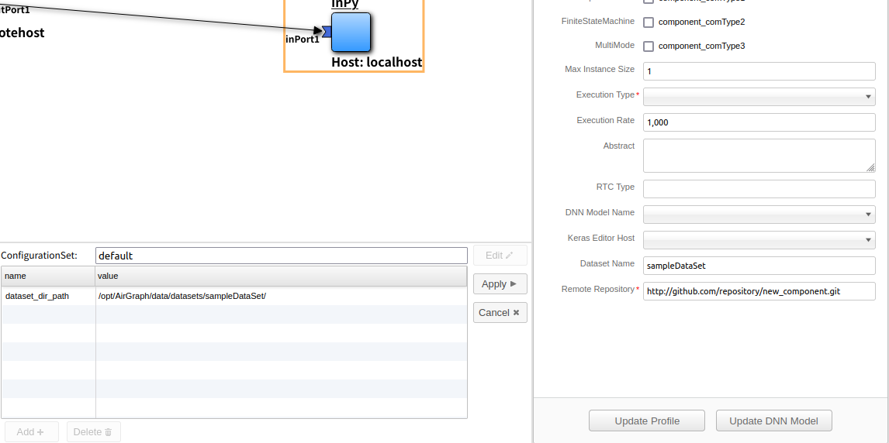

.. AirGraph documentation master file, created by
   sphinx-quickstart on Wed Aug  1 22:17:25 2018.
   You can adapt this file completely to your liking, but it should at least
   contain the root `toctree` directive.

ロボット開発とDeep Learning開発の連携について
================================================
ロボット開発からDeep Learning開発への連携機能
------------------------------------------------
1. AirGraph(RTM Editor)側でコンポーネントのプロパティ設定にてDatasetを定義すると，サーバ上にDataset領域が作成されます．

 - コンポーネントのコンフィギュレーションにも自動反映され，学習のためのデータセット保存先の指定が簡単になります．

.. image:: ../img/rtm_add_dataset.png
  :width: 70%
  :align: center

- C++の場合

.. code-block:: csharp

  // <rtc-template block="config_declare">
  /*!
   *
   * - Name:  dataset_dir_path
   * - DefaultValue: /opt/AirGraph/data/datasets/SampleDataset/
   */
  std::string m_dataset_dir_path;
  // </rtc-template>

.. code-block:: csharp

  RTC::ReturnCode_t CppTest::onInitialize()
  {
    // Bind variables and configuration variable
    bindParameter("dataset_dir_path", m_dataset_dir_path, "/opt/AirGraph/data/datasets/SampleDataset/");
  
    return RTC::RTC_OK;
  }

- Pythonの場合

.. code-block:: python

	def __init__(self, manager):
		OpenRTM_aist.DataFlowComponentBase.__init__(self, manager)
		# initialize of configuration-data.
		# <rtc-template block="init_conf_param">
		"""
		 - Name:  dataset_dir_path
		 - DefaultValue: /opt/AirGraph/data/datasets/SampleDataset/
		"""
		self._dataset_dir_path = ['/opt/AirGraph/data/datasets/SampleDataset/']
		# </rtc-template>

2. AirGraph(Keras Editor)のプロパティ設定では，AirGraph(RTM Editor)で定義したDatasetを選択することが可能です．

 - この機能により，RTシステム側で取得したデータセットをそのままKeras側で学習に用いることが可能となります．

3. AirGraph(RTM Editor)では，データセット保存先に出力される画像ファイルをシステム実行中に確認することが可能です

- 画面上部の[Tools]-[Dataset Viewer]を押下する．
- [Dataset Name]にて表示したいデータセットを選択する.
- 選択したデータセット保存ディレクトリの最新画像が表示されます.システム実行中の場合は定期的に画像が更新されます.

.. image:: ../img/dataset_viewer.png
  :width: 50%
  :align: center

Deep Learning開発からロボット開発への連携機能
---------------------------------------------
1. AirGraph(Keras Editor)側でモデルを作成して保存すると，AirGraph(RTM Editor)側のコンポーネントのプロパティ画面でモデルの選択が可能となります．

 - モデルを選択すると，コンポーネントのコンフィギュレーションにも自動反映され，推論のためのモデルの指定が簡単になります．

.. image:: ../img/rtm_select_dnn.png
  :width: 70%
  :align: center

- C++の場合

.. code-block:: csharp

  // <rtc-template block="config_declare">
  /*!
   *
   * - Name:  dnn_model_path
   * - DefaultValue: /opt/AirGraph/data/keras_models/MnistSample/MnistSample.json
   */
  std::string m_dnn_model_path;
  // </rtc-template>

.. code-block:: csharp

  RTC::ReturnCode_t CppTest::onInitialize()
  {
    // Bind variables and configuration variable
    bindParameter("dnn_model_path", m_dnn_model_path, "/opt/AirGraph/data/keras_models/MnistSample/MnistSample.json");
  
    return RTC::RTC_OK;
  }

- Pythonの場合

.. code-block:: python

	def __init__(self, manager):
		OpenRTM_aist.DataFlowComponentBase.__init__(self, manager)
		# initialize of configuration-data.
		# <rtc-template block="init_conf_param">
		"""
		 - Name:  dnn_model_path
		 - DefaultValue: /opt/AirGraph/data/keras_models/MnistSample/MnistSample.json
		"""
		self._dnn_model_path = ['/opt/AirGraph/data/keras_models/MnistSample/MnistSample.json']
		# </rtc-template>

2. AirGraph(Keras Editor)でも，データセット保存先に保存されている画像ファイルを一覧することが可能です.

- 画面上部の[Tools]-[Dataset Viewer]を押下する．
- 表示されたダイアログ上部の[Dataset Name]にて表示したいデータセットを選択する.
- 選択したデータセット保存ディレクトリの画像が一覧表示されます.

複数マシンにおけるAirGraphの連携方法
----------------------------------------

ロボットにAirGraphをインストールすることで，ロボット・Deep Learningの両方の開発が可能ですが，
Deep Learningの学習自体は高スペックなマシンで実行した方が良い場合もあります.
AirGraphは複数マシン間でのデータセットの連携が可能です.

連携を行うためには、あらかじめapplication.propertiesファイルに連携先のホスト名を定義しておく必要があります

.. code-block:: none

  # Airgraph for Robot Hostname (comma separated)
  airgraph.rtm_editor.server.uri=localhost:8080

  # Airgraph for Keras Hostname
  airgraph.keras_editor.server.uri=localhost:8080

1. AirGraph(Keras Editor)では別マシン上のAirGraphからデータセットを取得することが可能です.

- 画面上部の[Tools]-[Dataset Viewer]を押下する．
- 表示されたダイアログ下部の[Robot Name][Dataset Name]にて取得したいロボットのホスト名，データセット名を選択する.
- [Donwload]ボタンを押下すると選択したロボットから選択したデータセットの内容をダウンロードします.

.. image:: ../img/dataset_downloader_2.png
  :width: 50%
  :align: center

2. AirGraph(RTM Editor)では別マシン上のAirGraphから学習済のモデルを取得することが可能です．

- コンポーネントにDNNモデルが設定された状態で，コンポーネントのプロパティ設定エリアの[Update DNN Model]ボタンを押下する．
- 定義されているAirGraphから設定されているDNNモデルをダウンロードします

.. image:: ../img/update_dnn_model.png
  :width: 50%
  :align: center
