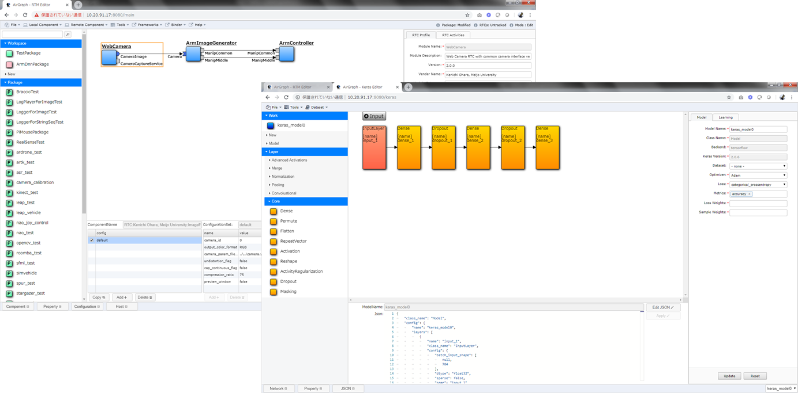

.. AirGraph documentation master file, created by
   sphinx-quickstart on Wed Aug  1 22:17:25 2018.
   You can adapt this file completely to your liking, but it should at least
   contain the root `toctree` directive.

AirGraphについて
========================
| AirGraphはWebブラウザ上で動作するRTミドルウェア・ニューラルネットワークの開発ツールです．
| あらかじめロボットのPCにインストールしておくことで，開発者はWebブラウザでアクセスするだけでロボットやニューラルネットワークの開発を行うことが可能です．
| AirGraphは 'AI and Robot Graphical IDE' の略称です．

`Source Code(GitHub) <https://github.com/sec-airgraph/airgraph.git>`_

共同研究のご紹介
===================
セックは，2016年10月より人工知能をロボットに応用する研究の第一人者である，
早稲田大学基幹理工学部表現工学科　尾形哲也教授と共同研究を行っています．

**共同研究テーマ：「ロボットにも搭載可能な人工知能・機械学習プラットフォーム」**

研究背景
-------------
近年，人工知能技術の発達とともに，人工知能技術のロボットへの応用が期待されております．
異なる学術領域に属するロボット分野と人工知能分野は日々発達しており，
ロボットへ人工知能技術を応用するためには，ロボットやDeep Learningの一方の知識だけではなく，
双方の知識・開発技術が必要となっていると考えます．

研究目的
-------------

.. image:: ../img/intro.png
  :width: 70%
  :align: center

Deep Learning技術のロボットへの応用を目指したときに存在する問題として以下の2点が考えられます．

- **ロボット開発環境の複雑さ**
- **Deep Learning開発環境の独立性**

当社では，それらの問題を解決するため，以下の3つを目標に研究開発を行っております．

1. **簡易に利用可能なロボット開発環境の実現**
2. **ロボット開発環境と同環境内で動作するDeep Learning開発ツールの実現**
3. **ロボット開発環境とDeep Learning開発環境の連携**

研究成果
-------------
1. **計測自動制御学会システムインテグレーション部門講演会（SI2017）**

 - **発表タイトル：「ロボットシステムとディープニューラルネットワークのシームレスな連携を実現する統合開発環境」**
 - **優秀講演賞を受賞**

2. **計測自動制御学会システムインテグレーション部門講演会（SI2018）**

 - **発表タイトル：「ロボットシステムとニューラルネットワークの統合開発環境の活用事例と改善提案」**

システム要件
================
- `システム要件(GitHub) <https://github.com/sec-airgraph/airgraph#system-requirements>`_

インストール手順
====================
- `インストール手順(GitHub) <https://github.com/sec-airgraph/airgraph#install-airgraph>`_

