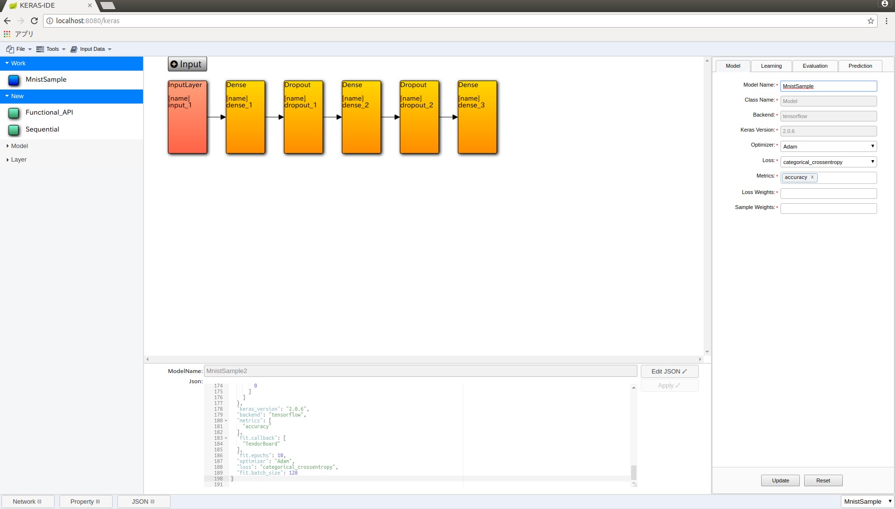
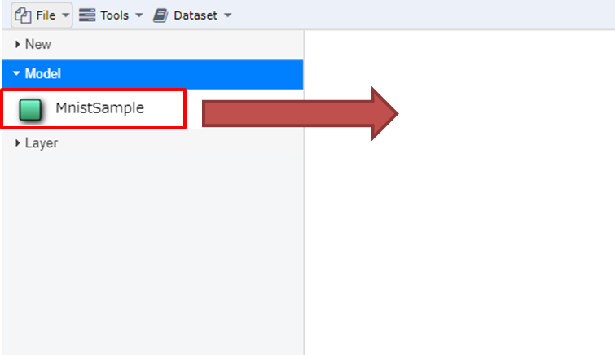
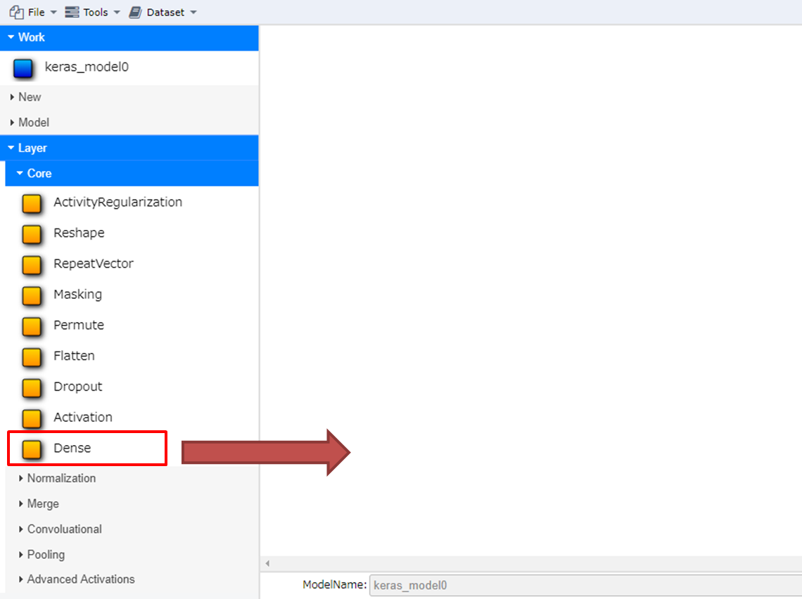
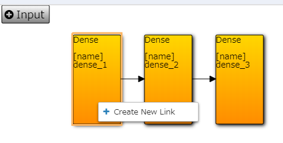
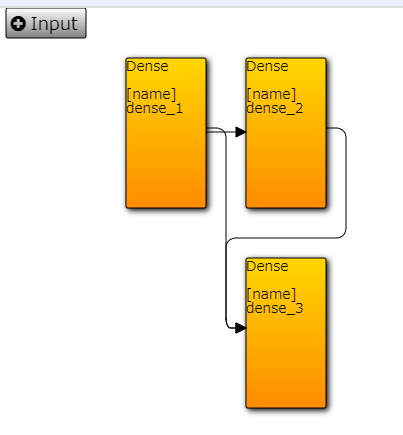
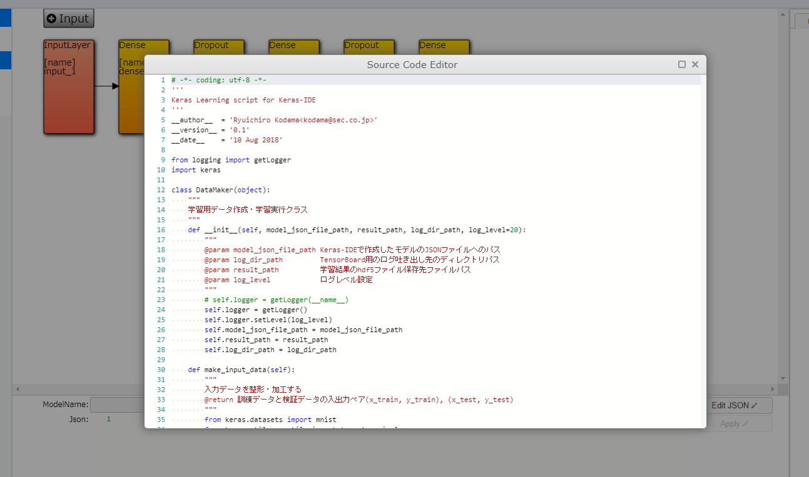

.. AirGraph documentation master file, created by
   sphinx-quickstart on Wed Aug  1 22:17:25 2018.
   You can adapt this file completely to your liking, but it should at least
   contain the root `toctree` directive.

AirGraph (Keras Editor)
========================

概要
---------
AirGraph(Keras Editor)の主な機能は次の通りです．

- WEBブラウザ上でKerasによるDNN開発が可能
- 作成したモデル単位での一覧・再利用が可能
- 既存のKerasモデルをインポートすることが可能

- 画面構成

 - 画面上部：操作メニューエリア
 - 画面左部：モデル・レイヤーの一覧表示エリア
 - 画面右部：モデル・レイヤーのプロパティ設定エリア
 - 画面下部：モデルのJSON表示・編集エリア
 - 画面中央：モデル開発エリア

使い方(Functional API)
-----------------------
AirGraphでは，Kerasのモデル種別「Sequence」「Functional API」の双方に対応しています．
本ドキュメントでは，「Functional API」の場合の操作方法のみ，紹介します．

モデルを新規に作成する
'''''''''''''''''''''''

.. image:: ../img/keras_create_model.png
  :width: 70%
  :align: center

1. 画面左部の[New]-[Functional_API]を画面中央にドラッグ＆ドロップします．
2. 画面左部の[Workspace]に新しいモデルが表示され，画面中央には何もない状態になります．

モデルを流用して作成する
''''''''''''''''''''''''

1．画面左部の[Model]の任意のモデルを画面中央にドラッグ＆ドロップします．
2. 画面左部の[Workspace]にコピーされたモデルが表示され，画面中央にはそのモデル構造が表示されます．

モデルのプロパティを変更する
'''''''''''''''''''''''''''''''''''

.. image:: ../img/keras_update_model.png
  :width: 70%
  :align: center

1. 以下の方法でモデルの設定画面を起動します．

 - レイヤーが未選択の状態で，画面下部の[Property]ボタンを押下する（画面右部に表示されます）．

2. 必要な箇所を変更し，[Update]ボタンを押下します．

モデルにレイヤーを追加する
'''''''''''''''''''''''''''

.. image:: ../img/keras_layer_added.png
  :width: 40%
  :align: center

1. 画面左部の[Layer]の任意のレイヤーを画面中央にドラッグ＆ドロップします．
2. 画面中央のモデルに新たなレイヤーが表示されます．
3. 追加したレイヤーを削除する場合は，レイヤーを選択しキーボードの[Delete]キーを押下します．

モデルに入力レイヤーを追加する
''''''''''''''''''''''''''''''

.. image:: ../img/keras_add_input_layer.png
  :width: 40%
  :align: center

.. image:: ../img/keras_input_layer_added.png
  :width: 40%
  :align: center

1. 画面中央の[+Input]ボタンを押下します．
2. 画面中央のモデルに新たに入力レイヤーが表示されます．

レイヤーのプロパティを変更する
'''''''''''''''''''''''''''''''''''

.. image:: ../img/keras_update_layer.png
  :width: 70%
  :align: center

1. 以下の方法でレイヤーの設定画面を起動します．

 - レイヤーを選択している状態で，画面下部の[Property]ボタンを押下する（画面右部に表示されます）．

2. 必要な箇所を変更し，[Update]ボタンを押下します．

レイヤー間の接続を編集する
''''''''''''''''''''''''''''''

.. image:: ../img/keras_drag_new_link.png
  :width: 40%
  :align: center

1. 画面中央のモデルのうち，起点となるレイヤーを選択し，右クリックメニューから[Create New Link]を選択します．
2. マウスカーソルに矢印の先頭が付いてくるため，接続先となるレイヤーをクリックする。
3. 画面中央表示が更新され，指定したレイヤ間が矢印で接続される。
4. 接続を削除する場合は，削除したい矢印を選択し，キーボードの[Delete]キーを押下すると，接続が削除される。

モデルを保存する
'''''''''''''''''''''''''''''''''''''

1. 以下のいずれかの方法でパッケージおよびコンポーネントの保存を行います．

 - 画面上部の[File]-[Save All]を押下する．
 - 画面中央の白い領域で表示される右クリックメニューの[save All]を押下する.

2. 全ての変更が保存されます．

データセットを登録する
'''''''''''''''''''''''''''''''''''''
AirGraphでは，学習・検証用にデータセットを登録する機能があります． [#]_

1. 画面上部の[Dataset]-[Upload Dataset]を押下する．
2. ファイルダイアログが表示されるので，アップロードしたいデータセットをまとめたzipファイルを選択し，アップロードする．

 - データセットのディレクトリ構成は以下のようになっている必要があります．以下の場合，データセットは **dataset1** という名称で登録されます．

  - hoge.zip

   - hoge/dataset1/data1.jpg
   - hoge/dataset1/data2.jpg
   - hoge/dataset1/data3.jpg
   - hoge/dataset1/data4.jpg

 - 同名のデータセットを登録した場合，新しいデータセットで全て上書きされます．

3. アップロード後，画面右側の[Model]-[Dataset]のプルダウンメニューからアップロードしたデータセットが選択可能となります．

.. rubric:: 注
.. [#] 現状，データセットの削除機能はありません．

学習を行う
'''''''''''''''

.. image:: ../img/keras_model_menu.png
  :width: 40%
  :align: center

.. image:: ../img/keras_learn_menu.png
  :width: 40%
  :align: center

1. ワークスペースにモデルが表示されている状態で，画面中央の白い領域で表示される右クリックメニューの[edit Data Maker]を押下する．
2. 表示されたポップアップ画面で，Pythonスクリプトを編集する．

 - Pythonスクリプトには，コマンドライン引数として以下の情報が渡されます

  - 第1引数: 編集中モデルのモデルファイル(json)のファイルパス
  - 第2引数: 学習した重みファイル(hdf5)を保存するファイルパス
  - 第3引数: TensorBoard向けのログファイルを出力するディレクトリパス
  - 第4引数: データセットのディレクトリパス [#]_

3. スクリプト編集完了後，ポップアップ画面を閉じ，モデルの保存を実施する．
4. 画面上部の[Tools]-[learn]を押下すると，Pythonスクリプトが実行され，コンソール出力を確認するポップアップ画面が表示される．

その他
-----------
Gitリポジトリの連携について
'''''''''''''''''''''''''''''
- 現時点で，AirGraph上から作成したモデルをGitリポジトリとして登録する機能はありません．

.. rubric:: 注
.. [#] データセット未指定の場合は空文字が渡されます
